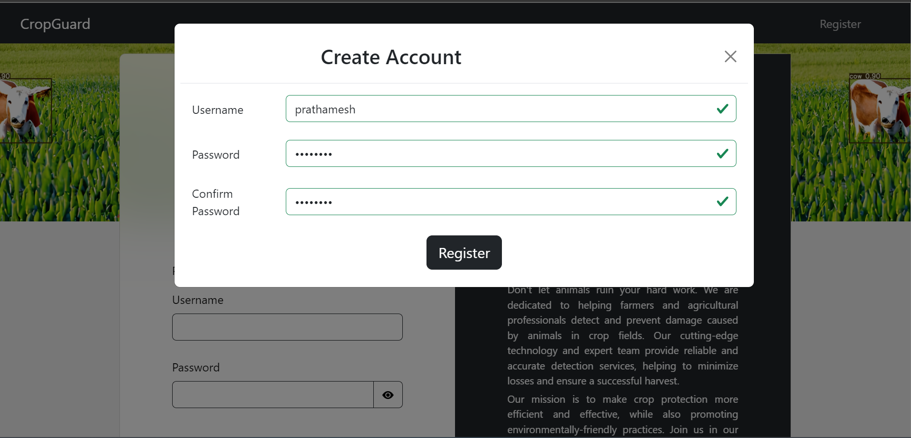

# CROP GUARD - ANIMAL DETECTION IN CROP FIELDS
*This project is developed as academic requirements in respect of major project work prescribed for the Bachelor of Engineering degree.*
The project titled "Crop Guard - Animal Detection in Crop Fields" aims to develop a software tool that detects wild animals entering the farm or crop fields and alerts farmers using an alarm system. The objective of this project is to provide a simple, fast, and cost-effective solution to the problem of crop damage caused by animal attacks, which is a major threat to crop yield. To achieve this, the proposed system leverages an image enhancement technique based on LSGAN (Least Square Generative Adversarial Network) to generate more realistic and diverse training images. The enhanced dataset is then used to train an object detection algorithm YOLO (You Only Look Once) version 7 for animal detection. The proposed system monitors the entire farm using cameras that record the surroundings and play appropriate sounds when animals are detected to drive them away from the fields. The system aims to ensure the safety of both human and animal by diverting animals without causing them any harm. The project is an attempt to develop an economical, time-saving solution that supports farmers and helps protect their crops from damage caused by animals.

### TECHNOLOGIES USED
1. YOLOv7
2. FLASK
3. TORCH
4. JAVASCRIPT
5. BOOTSTRAP
6. SQLITE

# SETUP AND RUN
1. Download and extract the repository
1. Open cmd inside this folder
2. Type commands - 
	a. pip install -r requirements.txt
	b. python app.py
3. Copy the url in browser which appears once server is started

# RESULTS
**Index Page**

**Register Page**

**Home Page**

**About Us Page**

**Detection Page**

**Live Detection**

**Report Page**

**Download Report**

